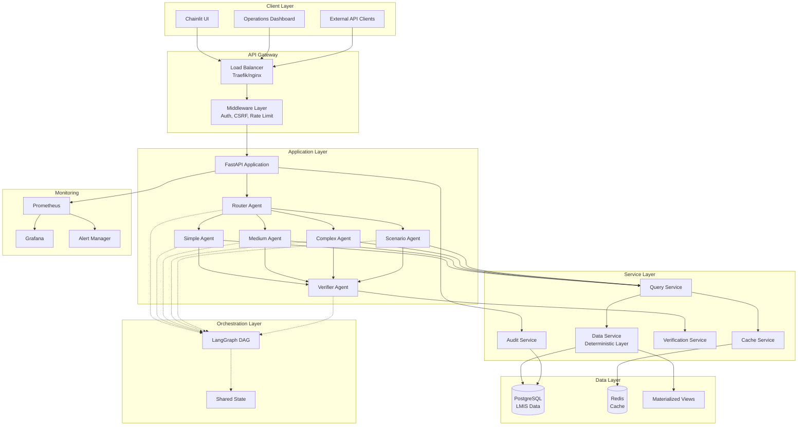
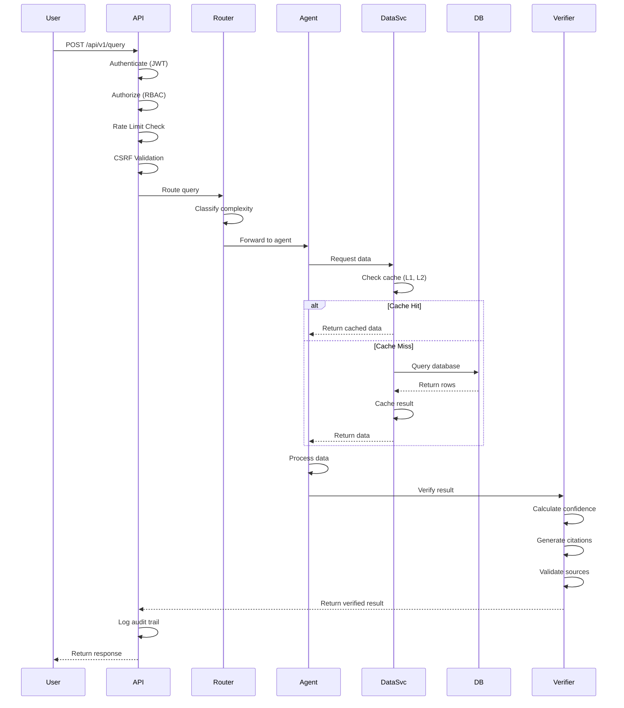
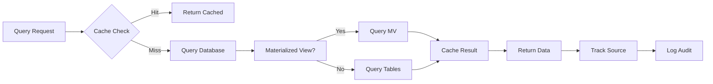

# QNWIS System Architecture

**Version:** 1.0.0  
**Last Updated:** 2025-01-12

## Overview

The Qatar National Workforce Intelligence System (QNWIS) is a production-grade analytical platform built on a multi-agent architecture with deterministic data guarantees. This document describes the system's architecture, design decisions, and key components.

## High-Level Architecture



## Core Components

### 1. Multi-Agent System

QNWIS uses six specialized agents orchestrated via LangGraph:

#### Router Agent
**Purpose**: Query classification and routing  
**SLO**: < 500ms  
**Responsibilities**:
- Analyze incoming queries
- Classify complexity (simple/medium/complex/scenario)
- Route to appropriate agent
- Extract query parameters

**Classification Logic**:

```python
def classify_query(question: str) -> QueryType:
    """
    Classify query complexity based on:
    - Number of entities mentioned
    - Time range requested
    - Aggregation complexity
    - Predictive vs. descriptive
    """
    if is_single_metric(question) and is_current_period(question):
        return QueryType.SIMPLE
    elif is_multi_table(question) or is_historical_comparison(question):
        return QueryType.MEDIUM
    elif is_predictive(question) or is_multi_sector_analysis(question):
        return QueryType.COMPLEX
    elif is_scenario_analysis(question):
        return QueryType.SCENARIO
    else:
        return QueryType.MEDIUM  # Default to medium
```

#### Simple Agent
**Purpose**: Fast, single-table queries  
**SLO**: < 10 seconds  
**Responsibilities**:
- Direct database lookups
- Basic filtering and sorting
- Single metric retrieval

**Example Queries**:
- "What is the current unemployment rate?"
- "How many people work in healthcare?"
- "Show me the latest GDP figures"

#### Medium Agent
**Purpose**: Multi-table queries with joins and aggregations  
**SLO**: < 30 seconds  
**Responsibilities**:
- Multi-table joins
- Aggregations and grouping
- Historical comparisons
- Trend analysis

**Example Queries**:
- "Compare employment trends in tech vs. construction"
- "Show wage growth by sector over 5 years"
- "What is the correlation between GDP and employment?"

#### Complex Agent
**Purpose**: Advanced analytics and correlations  
**SLO**: < 90 seconds  
**Responsibilities**:
- Multi-sector analysis
- Pattern discovery
- Correlation analysis
- Time-series forecasting

**Example Queries**:
- "Analyze factors affecting workforce retention"
- "Find patterns between infrastructure investment and job creation"
- "Predict skill gaps for next quarter"

#### Scenario Agent
**Purpose**: Predictive "what-if" analysis  
**SLO**: < 90 seconds  
**Responsibilities**:
- Policy impact modeling
- Scenario simulation
- Forecasting with confidence intervals
- Historical pattern matching

**Example Queries**:
- "What if we increase minimum wage by 15%?"
- "Predict impact of 20% increase in renewable energy investment"
- "Model effects of new visa policy on hospitality sector"

#### Verifier Agent
**Purpose**: Result verification and confidence scoring  
**SLO**: < 5 seconds  
**Responsibilities**:
- Validate data sources
- Calculate confidence scores
- Generate citations
- Ensure Deterministic Data Layer compliance

**Confidence Calculation**:

```python
def calculate_confidence(sources: List[DataSource]) -> float:
    """
    Calculate confidence score based on:
    - Data source authority (LMIS = 1.0, derived = 0.8)
    - Data freshness (recent = 1.0, old = 0.7)
    - Data completeness (100% = 1.0, partial = 0.6)
    - Cross-validation (multiple sources = higher confidence)
    """
    if not sources:
        raise ValueError("No sources provided")
    
    weights = []
    for source in sources:
        authority = 1.0 if source.is_primary else 0.8
        freshness = calculate_freshness(source.timestamp)
        completeness = source.completeness_ratio
        
        weight = authority * freshness * completeness
        weights.append(weight)
    
    # Weighted average with boost for multiple sources
    base_confidence = sum(weights) / len(weights)
    multi_source_boost = min(0.1 * (len(sources) - 1), 0.2)
    
    return min(base_confidence + multi_source_boost, 1.0)
```

### 2. Orchestration Layer (LangGraph)

**Purpose**: Coordinate agent workflow as a directed acyclic graph (DAG)

**Workflow Example**:

```python
from langgraph.graph import StateGraph, END

# Define workflow
workflow = StateGraph(QueryState)

# Add nodes (agents)
workflow.add_node("router", router_agent)
workflow.add_node("simple", simple_agent)
workflow.add_node("medium", medium_agent)
workflow.add_node("complex", complex_agent)
workflow.add_node("scenario", scenario_agent)
workflow.add_node("verifier", verifier_agent)

# Add edges (routing logic)
workflow.add_edge("router", "simple", condition=lambda s: s.query_type == "simple")
workflow.add_edge("router", "medium", condition=lambda s: s.query_type == "medium")
workflow.add_edge("router", "complex", condition=lambda s: s.query_type == "complex")
workflow.add_edge("router", "scenario", condition=lambda s: s.query_type == "scenario")

workflow.add_edge("simple", "verifier")
workflow.add_edge("medium", "verifier")
workflow.add_edge("complex", "verifier")
workflow.add_edge("scenario", "verifier")

workflow.add_edge("verifier", END)

# Set entry point
workflow.set_entry_point("router")

# Compile graph
app = workflow.compile()
```

**Shared State**:

```python
from typing import Optional, List, Dict, Any
from pydantic import BaseModel

class QueryState(BaseModel):
    """Shared state passed between agents."""
    
    # Input
    question: str
    user_id: str
    session_id: str
    
    # Router output
    query_type: Optional[str] = None
    extracted_entities: Optional[Dict] = None
    
    # Query agent output
    data: Optional[Dict] = None
    data_sources: Optional[List[DataSource]] = None
    
    # Verifier output
    confidence_score: Optional[float] = None
    citations: Optional[List[Citation]] = None
    
    # Metadata
    start_time: float
    agent_path: List[str] = []
    errors: List[str] = []
```

### 3. Deterministic Data Layer

**Critical Contract**: QNWIS never fabricates data. Every response is traceable to source tables.

**Architecture**:

```python
class DataService:
    """
    Deterministic Data Layer implementation.
    
    Guarantees:
    1. All data comes from verified LMIS tables
    2. Every query is logged with source tracking
    3. No synthetic or inferred data without explicit labeling
    4. Complete audit trail for all data access
    """
    
    def query(
        self,
        table: str,
        filters: Dict[str, Any],
        track_source: bool = True
    ) -> QueryResult:
        """
        Query LMIS data with source tracking.
        
        Args:
            table: LMIS table name (validated against whitelist)
            filters: Query filters (parameterized)
            track_source: Enable source tracking (always True in production)
            
        Returns:
            QueryResult with data, source metadata, and audit trail
        """
        # Validate table name (prevent SQL injection)
        if table not in ALLOWED_TABLES:
            raise ValueError(f"Invalid table: {table}")
        
        # Build parameterized query
        query = select(self._get_model(table))
        for key, value in filters.items():
            query = query.where(getattr(self._get_model(table), key) == value)
        
        # Execute query
        start_time = time.time()
        result = self.db.execute(query).scalars().all()
        query_time = time.time() - start_time
        
        # Track source
        if track_source:
            source_metadata = SourceMetadata(
                table=table,
                row_ids=[r.id for r in result],
                query_timestamp=datetime.utcnow(),
                query_time_ms=int(query_time * 1000),
                data_classification=self._get_classification(table)
            )
            self._log_data_access(source_metadata)
        
        return QueryResult(
            data=[r.to_dict() for r in result],
            source=source_metadata,
            deterministic=True  # Always True
        )
```

**Source Tracking**:

Every data point includes:
- Source table name
- Row IDs accessed
- Query timestamp
- Data classification level
- User who accessed it

**Verification**:

```python
def verify_deterministic(result: QueryResult) -> bool:
    """
    Verify result complies with Deterministic Data Layer.
    
    Checks:
    1. Source metadata present
    2. All data traceable to LMIS tables
    3. No synthetic data without labeling
    4. Audit trail complete
    """
    if not result.source:
        return False
    
    if result.source.table not in ALLOWED_TABLES:
        return False
    
    if not result.source.row_ids:
        return False
    
    if not result.source.query_timestamp:
        return False
    
    return True
```

### 4. Security Layer (Step 34)

**Defense in Depth**:

```
┌─────────────────────────────────────────┐
│  Network: TLS 1.2+, Firewall            │
├─────────────────────────────────────────┤
│  Application: CSRF, CORS, CSP, HSTS     │
├─────────────────────────────────────────┤
│  Authentication: JWT, SSO (SAML)        │
├─────────────────────────────────────────┤
│  Authorization: RBAC, Row-level         │
├─────────────────────────────────────────┤
│  Data: Encryption, Audit Logging        │
├─────────────────────────────────────────┤
│  Monitoring: Alerts, Anomaly Detection  │
└─────────────────────────────────────────┘
```

**Key Controls**:
- HTTPS only (TLS 1.2+)
- CSRF protection on state-changing requests
- Rate limiting (100 req/hour default)
- RBAC with 4 roles (viewer, analyst, ops, admin)
- Complete audit logging
- CSP and HSTS headers

See [SECURITY.md](./SECURITY.md) for complete details.

### 5. Performance Layer (Step 35)

**Multi-Layer Caching**:

```
Request → L1 (Memory, 100ms TTL) → L2 (Redis, 15-60min TTL) 
       → L3 (Materialized Views, hourly) → L4 (Database)
```

**Optimization Strategies**:
- Connection pooling (DB: 20+10, Redis: 50)
- Query optimization with indexes
- Materialized views for aggregations
- Response compression (gzip)
- Async processing for long operations

**SLO Targets**:
- Simple: < 10s (p95)
- Medium: < 30s (p95)
- Complex: < 90s (p95)
- Dashboard: < 3s (p95)

See [PERFORMANCE.md](./PERFORMANCE.md) for complete details.

## Data Flow

### Query Processing Sequence



### Data Access Pattern



## Database Schema

### LMIS Tables (60+ tables)

**Core Tables**:

```sql
-- Employment statistics (most queried)
CREATE TABLE qtr_employment_stats (
    id BIGSERIAL PRIMARY KEY,
    quarter VARCHAR(10) NOT NULL,
    sector VARCHAR(100) NOT NULL,
    employment_count INTEGER NOT NULL,
    unemployment_rate DECIMAL(5,4),
    avg_wage_qar DECIMAL(10,2),
    data_source VARCHAR(50) NOT NULL DEFAULT 'LMIS_PROD',
    classification VARCHAR(20) NOT NULL DEFAULT 'internal',
    created_at TIMESTAMP NOT NULL DEFAULT NOW(),
    updated_at TIMESTAMP NOT NULL DEFAULT NOW()
);

CREATE INDEX idx_employment_sector_quarter ON qtr_employment_stats(sector, quarter);
CREATE INDEX idx_employment_quarter ON qtr_employment_stats(quarter DESC);

-- Wage statistics
CREATE TABLE wage_stats (
    id BIGSERIAL PRIMARY KEY,
    quarter VARCHAR(10) NOT NULL,
    sector VARCHAR(100) NOT NULL,
    occupation VARCHAR(200),
    avg_wage_qar DECIMAL(10,2) NOT NULL,
    median_wage_qar DECIMAL(10,2),
    wage_growth_pct DECIMAL(5,2),
    data_source VARCHAR(50) NOT NULL DEFAULT 'LMIS_PROD',
    created_at TIMESTAMP NOT NULL DEFAULT NOW()
);

-- Sector trends
CREATE TABLE sector_trends (
    id BIGSERIAL PRIMARY KEY,
    sector VARCHAR(100) NOT NULL,
    quarter VARCHAR(10) NOT NULL,
    growth_rate DECIMAL(5,2),
    employment_change INTEGER,
    investment_qar DECIMAL(15,2),
    data_source VARCHAR(50) NOT NULL DEFAULT 'LMIS_PROD',
    created_at TIMESTAMP NOT NULL DEFAULT NOW()
);
```

**Audit Tables**:

```sql
-- Query audit log
CREATE TABLE audit.query_log (
    id BIGSERIAL PRIMARY KEY,
    query_id VARCHAR(50) UNIQUE NOT NULL,
    user_id VARCHAR(255) NOT NULL,
    question TEXT NOT NULL,
    query_type VARCHAR(20),
    confidence_score DECIMAL(3,2),
    response_time_ms INTEGER,
    agents_used TEXT[],
    data_sources JSONB,
    created_at TIMESTAMP NOT NULL DEFAULT NOW()
);

CREATE INDEX idx_query_log_user ON audit.query_log(user_id, created_at DESC);
CREATE INDEX idx_query_log_query_id ON audit.query_log(query_id);

-- Data access log
CREATE TABLE audit.data_access_log (
    id BIGSERIAL PRIMARY KEY,
    user_id VARCHAR(255) NOT NULL,
    table_name VARCHAR(100) NOT NULL,
    row_ids BIGINT[],
    query_timestamp TIMESTAMP NOT NULL,
    data_classification VARCHAR(20),
    created_at TIMESTAMP NOT NULL DEFAULT NOW()
);

CREATE INDEX idx_data_access_user ON audit.data_access_log(user_id, created_at DESC);
CREATE INDEX idx_data_access_table ON audit.data_access_log(table_name, created_at DESC);
```

See [DATA_DICTIONARY.md](./DATA_DICTIONARY.md) for complete schema.

## Deployment Architecture

### Production Environment

```
┌─────────────────────────────────────────────────────────┐
│                    Load Balancer                        │
│                  (Traefik/nginx)                        │
└────────────────────┬────────────────────────────────────┘
                     │
        ┌────────────┼────────────┐
        │            │            │
   ┌────▼───┐   ┌───▼────┐   ┌──▼─────┐
   │ App-01 │   │ App-02 │   │ App-03 │
   │ 9 workers│ │ 9 workers│ │ 9 workers│
   └────┬───┘   └───┬────┘   └──┬─────┘
        │            │            │
        └────────────┼────────────┘
                     │
        ┌────────────┼────────────┐
        │            │            │
   ┌────▼─────┐ ┌───▼──────┐ ┌──▼────────┐
   │PostgreSQL│ │  Redis   │ │Prometheus │
   │ Primary  │ │ Primary  │ │  Metrics  │
   └────┬─────┘ └───┬──────┘ └──┬────────┘
        │            │            │
   ┌────▼─────┐ ┌───▼──────┐ ┌──▼────────┐
   │PostgreSQL│ │  Redis   │ │  Grafana  │
   │ Replica  │ │ Replica  │ │Dashboards │
   └──────────┘ └──────────┘ └───────────┘
```

**Specifications**:
- **App Servers**: 3x (4 vCPU, 16GB RAM, 100GB SSD)
- **Database**: Primary + Replica (8 vCPU, 32GB RAM, 500GB SSD)
- **Redis**: Primary + Replica (2 vCPU, 8GB RAM, 50GB SSD)
- **Load Balancer**: 2 vCPU, 4GB RAM

### High Availability

**Database Replication**:
- Streaming replication (async)
- Automatic failover with pg_auto_failover
- Replication lag monitoring (< 1 minute)

**Application Redundancy**:
- 3 application servers
- Load balancing with health checks
- Graceful shutdown and rolling updates

**Cache Redundancy**:
- Redis primary + replica
- Automatic failover with Redis Sentinel
- Cache warming after failover

## Monitoring and Observability

### Metrics Collection

**Application Metrics** (`/metrics`):
- Query performance (duration, throughput)
- Cache hit rates
- Error rates
- Agent utilization

**System Metrics**:
- CPU, memory, disk usage
- Network I/O
- Database connections
- Redis memory

**Business Metrics**:
- Queries per user
- Most common query types
- SLO compliance
- User satisfaction (implicit)

### Logging

**Structured JSON Logging**:

```json
{
  "timestamp": "2024-11-12T05:03:00Z",
  "level": "INFO",
  "logger": "qnwis.agents.simple",
  "message": "Query processed successfully",
  "query_id": "q_2024_001234",
  "user_id": "analyst_123",
  "response_time_ms": 3200,
  "cache_hit": false,
  "data_sources": ["qtr_employment_stats"],
  "confidence_score": 0.94
}
```

**Log Aggregation**:
- Centralized logging (ELK/Loki)
- 90-day retention
- Full-text search
- Real-time alerting

### Alerting

**Critical Alerts**:
- Service down
- High error rate (> 1%)
- Database connection failure
- SLO breach

**Warning Alerts**:
- Performance degradation
- Low cache hit rate
- High memory usage
- Replication lag

## Design Decisions

### Why Multi-Agent Architecture?

**Advantages**:
- **Specialization**: Each agent optimized for specific query types
- **Performance**: Parallel processing where possible
- **Maintainability**: Clear separation of concerns
- **Scalability**: Scale agents independently
- **Observability**: Track performance by agent

**Trade-offs**:
- Increased complexity
- Orchestration overhead
- More components to monitor

### Why LangGraph for Orchestration?

**Advantages**:
- **Flexibility**: DAG allows complex workflows
- **State Management**: Shared state between agents
- **Debugging**: Visualize execution flow
- **Extensibility**: Easy to add new agents

**Alternatives Considered**:
- Direct function calls (too rigid)
- Message queue (too complex for our needs)
- Celery (overkill for synchronous workflows)

### Why PostgreSQL?

**Advantages**:
- **ACID compliance**: Data integrity guarantees
- **Rich query capabilities**: Complex joins, aggregations
- **Mature ecosystem**: Tools, extensions, expertise
- **Performance**: Excellent for OLTP and light OLAP

**Alternatives Considered**:
- MySQL (less feature-rich)
- MongoDB (not suitable for relational data)
- ClickHouse (overkill for our query volume)

### Why Redis for Caching?

**Advantages**:
- **Performance**: Sub-millisecond latency
- **Data structures**: Flexible caching strategies
- **Persistence**: Optional durability
- **Clustering**: Easy to scale

**Alternatives Considered**:
- Memcached (less feature-rich)
- Application memory (no distribution)
- Database caching (slower)

## Future Enhancements

### Planned Improvements

1. **Machine Learning Integration**
   - Automated query classification
   - Confidence score prediction
   - Anomaly detection

2. **Advanced Caching**
   - Predictive cache warming
   - Query result prefetching
   - Intelligent TTL adjustment

3. **Horizontal Scaling**
   - Database sharding (if needed)
   - Read replicas for analytics
   - Distributed caching

4. **Enhanced Monitoring**
   - Distributed tracing (OpenTelemetry)
   - User behavior analytics
   - Cost attribution

### Scalability Limits

**Current Capacity**:
- 100 concurrent users
- 67 queries/minute
- 1M queries/month

**Scaling Options**:
- Add application servers (horizontal)
- Increase database resources (vertical)
- Add read replicas (horizontal)
- Implement caching layers (performance)

**Estimated Limits**:
- 500 concurrent users (with current architecture)
- 300 queries/minute (with optimizations)
- 10M queries/month (with scaling)

---

**For implementation details, see**:
- [DEVELOPER_ONBOARDING.md](./DEVELOPER_ONBOARDING.md) - Development guide
- [SECURITY.md](./SECURITY.md) - Security architecture
- [PERFORMANCE.md](./PERFORMANCE.md) - Performance optimization
- [DATA_DICTIONARY.md](./DATA_DICTIONARY.md) - Database schema
